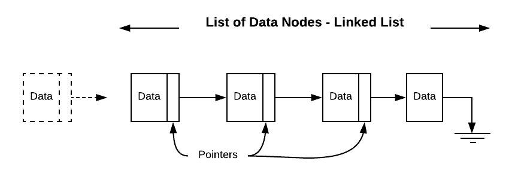
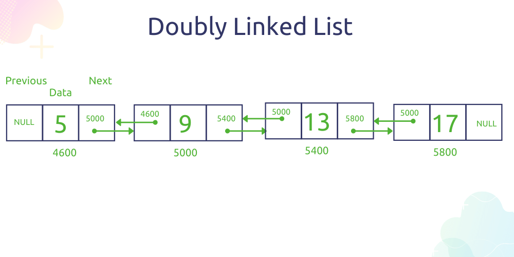
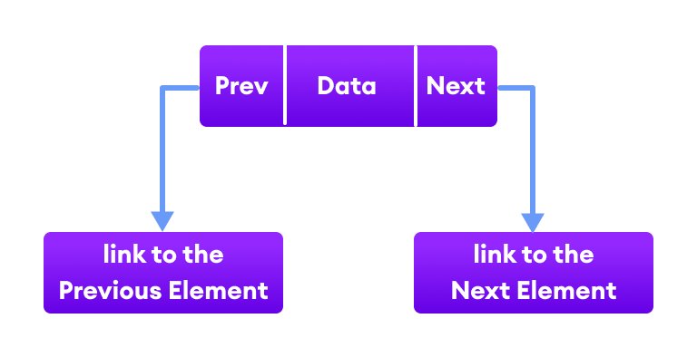

# **Linked List  Tutriol**

## Table of contents

***Introduction***

***Examples of problems*** 

***Problems*** 

***Solution*** 


# Introduction

***Hello Class!*** Today we will be learning about the linkedlist. Let’s start with understanding What is linkedlist? Let's look at the image and pause and think what you see in here.



A collection of data which are stored in a randomly within memory, the elements are linked using pointers as we can see in picture above. Like arrays, Linked list is a linear data structure.With a linked list, each element in the list is at some location in memory. If you like to visualize linked list we can visualize as a many boxes connected with each other. There is no guarantee that one element will be next to another element. In order to keep our list together, each element (**which we will call a node**) will contain both the value and a link to the next node in the list. Specifically, the link will be a pointer to the location in memory that contains our next element.



Most linked lists maintain a bi-directional linking between nodes. Bi-directional means that each node will keep a pointer to both the next node and the previous node. The doubly-linked list shown below has both a head and a tail.

# Node structure
Doubly linked list has connection backward and forward through the list.This means when we structure the node we need to add two property i.e prev and next.

```
class DoubleNode:
    def __init__(self,value):
        self.value = value
        self.prev = None
        self.next = None
```
Now that we have backwards connections it makes sense to track the tail of the linked list as well as the head. 
## Linked list structure

So far we got basic idea of how the structure of the node works now lets go ahead and implement the appending method in the Doubly Linked List class. 
* ***Basic structure of linked lists***

We are aware the double linked list consist of head and tail therefore when we insantiate the class we want both the head and tail to be there. 
```python
class DoublyLinkedList:
    def __init__(self):
        self.head = None 
        self.tail = None
```   

## Operations on Linked List

* Insertion 
* Remove
* Access

# Insertion into a linked list

## Insert at the beginning

set the current head as the next node
set the new node as the head 

```python

class LinkedList:
    def __init__(self):
        self.head = None 
        self.tail = None 
    def prepend(self,data):
        # Create a new Node
        new_node = Node(data)
        # Check if the list was empty 
        if self.head is None:
            self.head = new_node 
            self.tail = self.head 
            return 
        else:
        #Check if the list was not empty and add the node in the beginning of the list 
            self.head.prev = new_node 
            new_node.next = self.head 
            self.head = new_node 
            self.tail = self.tail.next 
    
```   

## Insert at the Middle

* Create a new node called (new_node)

* Set the "prev" of the new node to the current node (new_node.prev = current)

* Set the "next" of the new node to the next node after current (new_node.next = current.next)

* Set the "prev" of the "next" node after current to the new node (current.next.prev = new_node)

* Set the next of the current node to the new node (current.next = new_node)



```python
def insert_after(self, target_data, new_node):
    if self.head is None:
        raise Exception("Empty list")

    for node in self:
        if node.data == target_data:
            new_node.next = node.next
            node.next = new_node
            return

    raise Exception("Target node not found")
```   

## Insert at the End

```python

class DoubleLinkedList:
    def __init__(self):
        self.head = None 
        self.tail = None 
    
    def append(self,value):
        # Check if the list was empty or not 
        if self.head is None:
            # Make the node both head and tail
            self.head = Node(vaue)
            self.tail = self.head
            return

        # Else if the list was not empty Append the node and update the pointers
        self.tail.next = Node(value)
        self.tail.next.previous = self.tail
        self.tail = self.tail.next

```   


# Remove from linked list 

## Delete at the beginning
* Set the "prev" of the second node (self.head.next) to nothing (self.head.next.prev = None)

* Set the head to be the second node (self.head = self.head.next)

```python

    class DoubleLinkedList:
        def __init__(self):
            self.head = None 
            self.tail = None 

        def remove_beginning(self)
            if self.head is None:
                print("The list is empty, nothing to remove!!")
                return 
            else:
                self.head = self.head.next 
                self.head.next.prev = None 
                self.tail = self.head 
```


## Delete at the Middle

* Set the prev of the node after current to the node before current (current.next.prev = current.prev)

* Set the next of the node before current to the node after current (current.prev.next = current.next)

```python

    class DoubleLinkedList:
        def __init__(self):
            self.head = None 
            self.tail = None 

        def remove_from_middle(self,key):

            if self.head is None:
                print("The list is empty nothing to remove from here!!!")
                return 
            current_head = self.head 

            while current_head:
                if current_head.data == key:
                    return 
                current_head = current_head.next 

            current_head.prev = current_head.next 
            current_head = None 


```


## Delete at the End

* Set the "next" of the second to last node (self.tail.prev) to nothing (self.tail.prev.next = None)

* Set the tail to be the second to last node (self.tail = self.tail.prev)


```python

    class DoublyLinkedList:
        def __init__(self):
            self.head = None 
            self.tail = None 

        def remove_end(self):
            if self.head is None:
                print("The list is empty, nothing to remove!!!")
                return 
            else:
                self.tail = self.tail.prev 
                self.tail.prev.next = None 
        
```

# Access from linked list

```python

    class DoublyLinkedList:
        def __init__(self):
            self.head = None 
            self.tail = None 

        def get_value(self,value):

            if self.head is None:
                print("The list is empty nothing to remove")
                return 

            current_head = self.head 
            while current_head:
                if current_head.data == key:
                    return current_head.data 
                current_head = current_head.next 
            
            print("Value not found!!")
            return 


```
By now we should get the general idea of how the doubly linked list works so, Lets go ahead and try to solve the real world example from what we have learned, because it lets you test the knowledge.

## Example of problem

From the given doubly linked list remove the duplicates.
For example:
1 -> 4 -> 7 -> 4 

should return 

1 -> 4 -> 7 

# Problem


# Solution 


```

    class Node:
        def __init__(self,value):
            self.value = value 
            self.next = None
            self.prev = None 
        
    class DoublyLinkedList:
        def __init__(self):
            self.head = None 
            self.tail = None 

    
    def remove_duplicates(self):
        current_head = self.head 
        seen = dict()
        while current_head:
            if current_head.data not in seen:
            seen[current_head.data] = 1
            current_head = current_head.next
            else:
                self.delete_node(current_head)
                current_head = current_head.next 
    def remove_node(self,node):
        if self.head is None:
            print("The list is empty, please add data before deleting it")
        
        current_head = self.head
        while current_head:
            if current_head.data == node.data:
                print("Node Deleted Successuflly")
                if current_head == self.tail:
                    # Remove Tail 
                    self.remove_tail()

                elif current_head == self.head():
                    # Remove Head 
                    self.remove_head()

                else:
                    current_head.next.prev = current_head.prev 
                    current_head.prev.next = current_head.next
                

            
            current_head = current_head.next 
```


# Linked List Complexity

Time Complexity

|Name          |Worst case 
|-----         |----       
|Insert        |O(1)       
|Search        |O(n)        
|remove front  |O(n)
|remove middle |O(n)
|remove end    |O(1)       


* [Go back to welcome page](welcome.md)