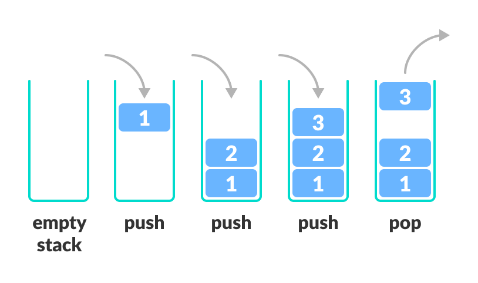
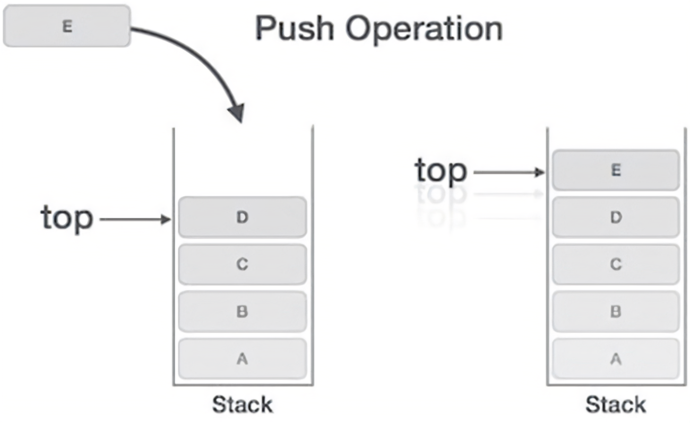
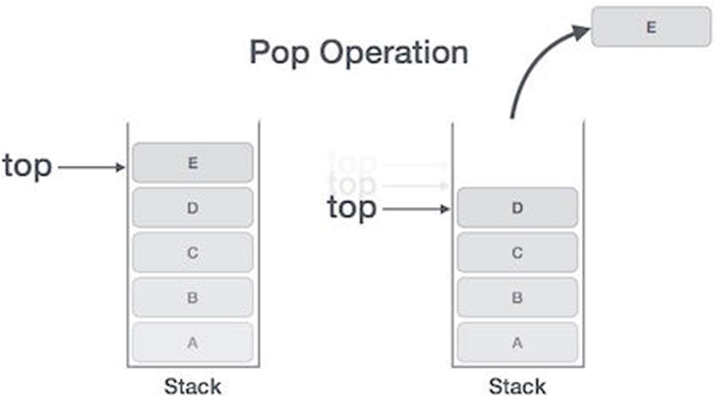

# **Stack Tutriol**

### Table of contents
**Introduction**

**Features of stack**

**Insertion Operation** 

**Deletion or removal operation** 

**Use of stack**

**Stack efficiency** 

**Examples of problems** 

**Problems** 

**Solution** 

# Introduction

**Hello Class!** Today we will be learning about the stack. Let’s start with understanding What is stack?
Personally, I like to imagine or think stack as example of pancakes or plates which you can stack them on top of one another. Anything that can help you imagine any object sits on top of one another.
Stack is a collection of data in which you can only add a piece of data at the top of the structure and retrieve the data only from the top of the structure.
Linear data structure 


# Feature of stack 

Stack is an ordered list of similar data types 
LIFO (‘last in first out’) data structure 
When stack is full it is called overflow state and when it is empty it is underflow state.



## Insertion operation 

## Push()

Push() – storing or pushing an element on the stack.



* Step 1 – checks if stacks is full 
* Step 2 – if the stack is full, produces an error and exit
* Step 3 – if the stack is not full, increments top to point next empty space.
* Step 4 – adds data element to the stack location, where top is pointing.
* Step 5 – returns success.


```python

def push(self.item):
    self.items.append(item)

```


## Deletion or removal operation

## Pop()

Pop() – removing or accessing an element from the stack.



* Step 1 – checks if stack is empty
* Step 2 – if the stack is empty, produces an error and exit.
* Step 3 – if stack is not empty, accesses the data element at which top is pointing.
* Step 4 – decreases the value of top by 1.
* Step 5 – decreases the value of top by 1.

```python

def pop(self):
    return self.items.pop()

```   

## Size() – size of the stack
Returns the number of items on the stack it needs no parameter

```python

def size(self):
    return len(self.items)

```   

## isEmpty() – check if stacks is empty
Test to see whether the stack is empty. It needs no parameter to return a boolean value.


```python

def isEmpty(self):zr
    return self.items == []


```   


## Implementing a stack in python  

```python
class Stack:
  def __init__(self):
    self.items = []
  
  def isEmpty(self):
    return self.items == []

  def push(self.item):
    self.items.append(item)

  def pop(self):
    return self.items.pop()

  def peek(self):
    return self.items[len(self.items) - 1]
  
  def size(self):
    return len(self.items)
```   


## Stack efficiency 

|Name           |Performance 
|-----          |----       
|push(value)    |O(1)   
|pop()          |O(1)   
|size()         |O(1)   
|empty()        |O(1)   


# Problem

Write a function that takes in array of integers representing stack, recursively sorts the stack in place (doesn't create a new array) and returns it 

The array must be treated as stack, with the end of the array as the top of the stack. 

Input: [-5,2,-2,4,3,1]
Ouput: [-5,-2,1,2,3,4]


# Solution 

```
def sortStack(stack):
  if len(stack)==0:
    return stack 

  top = stack.pop()

  sortStack(stack)

  insertInOrder(stack,top)

  return stack


  def insertInOrder(stack,value):
    if len(stack) ==0 or stack[len(stack)-1] <= value:
      stack.append(value)
      return 
    
    top = stack.pop()

    insertInOrder(stack,value)

    stack.append(top)

```

* [Go back to welcome page](welcome.md)